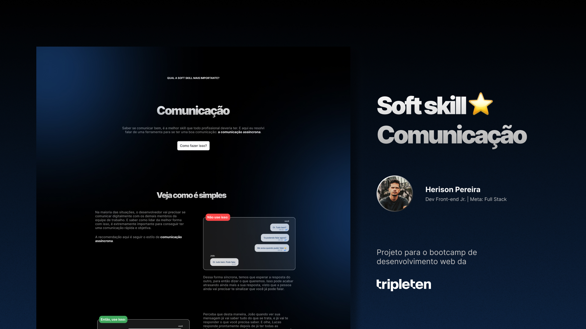

# Soft Skill - Comunicação

Bootcamp Desenvolvimento Web - TripleTen

- <a href="https://softskill-herison.vercel.app/" target="_blank">Veja o deploy</a>

## 👁 Preview

<p align="center">
  
</p>

## 🚀 Tecnologias

Esse projeto foi desenvolvido com as seguintes tecnologias:

- React
- Next.js
- Typescript
- Tailwindcss
- Vercel
- Git e GitHub

## 💻 Projeto

Projeto criado em desafio de gestão de carreira, pelo bootcamp de desenvolvimento web na TripleTen.

## Getting Started

Primeiro, inicie o servidor de desenvolvimento:

```bash
npm run dev
# or
yarn dev
# or
pnpm dev
# or
bun dev
```
